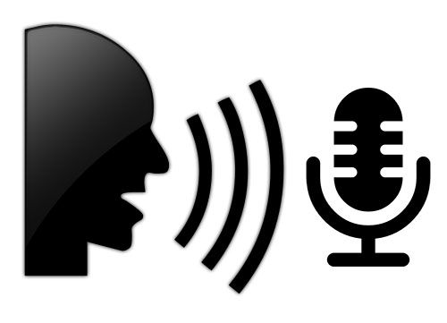

<p align="center">
   
<p>

# MMM-VoiceCommander


### WHAT IS VOICECOMMANDER?
This is a module for voice controlling a lot of elements of MagicMirror. It works as an offline voice controller where the MagicMirror does not need to be connected to Internet for VoiceCommander to work. Also, if you need a **HOTWORD** module to activate other online modules - this is it! It can activate either **Alexa** and **Google Assistant** using specific modules already available.


### WHAT CAN IT DO?
> Used as hotword only to activate either Google Assistant or Amazon Alexa

> Used as hotword to activate both Google Assistant and Amazon running at the same time

> Control other modules that use voice commands with a single microphone

> Built in `Motion Detection` for webcams to activate/de-activate upon motion/timout

> Use hand gesture to mute/resume sound (to issue new voice commands if speaker is busy - requires webcam)

> Take Selfies!  (Requires webcam and - https://github.com/alexyak/camera)

> Built in support for custom sound files

> Hide and show pages of modules

> Hide and show individual modules - ***No modification of other modules necessary!***

> Offline by default - no need for internet to issue commands

> Add your own sentences and custom commands `(**TODO**: Create instruction for json files)`


### TESTED ON FOLLOWING HARDWARE PLATFORMS

| Hardware Platform    |   Operating System   | Notes                                                                                                                                                                                                                                                                                             |
| -------------------- | -------------------- | ------------------------------------------------------------------------------------------------------------------------------------------------------------------------------------------------------------------------------------------------------------------------------------------------- |
| HP Elite 8300        | ✔  Ubuntu 18.04 LTS  | -                                                                                                                                                                                                                                                                                                 |
| HP Elite HPEu        | ✔  Ubuntu 16.04 LTS  | -                                                                                                                                                                                                                                                                                                 |
| HP G60 Laptop        | ✔  Ubuntu 18.04 LTS  | -                                                                                                                                                                                                                                                                                                 |
| Huawei Matebook Pro  | ✔  Ubuntu 16.04 LTS  | -                                                                                                                                                                                                                                                                                                 |
| Intel NUC Celeron    | ✔  Ubuntu 16.04 LTS  | -                                                                                                                                                                                                                                                                                                 |
| Tinker Board S       | ✔  TinkerOS 2.0.8    | -                                                                                                                                                                                                                                                                                                 |
| Raspberry Pi 3b+     | ✔  Debian Stretch    | -                                                                                                                                                                                                                                                                                                 |
| Odroid               | ✘                    | Need somebody to test on Odroid!                                                            |
| Windows              | ✘                    | Need somebody to test on Windows!                                                            |


### TESTED CAMERAS FOR MOTION DETECTION
* USB Logitech C920
* Several integrated laptop cams


## INSTALLATION AND REQUIREMENTS

Start by doing the commands below to make the initial installation: 

> Perform the commands from ***~/MagicMirror/modules*** directory

```
git clone https://github.com/thestigh/MMM-VoiceCommander
cd MMM-VoiceCommander
cd installers
bash dependencies.sh
```

After installation you need to check your `audio setup`, as this module also relies on ***arecord/aplay***.
From your home directory, run command:

> sudo nano ~/.asoundrc

If it is empty, copy following code to the editor (values might need to be changed):

```
pcm.!default{
  type asym
  playback.pcm{
     type plug
     slave.pcm "hw:0,0"
  }

  capture.pcm{
    type plug
    slave.pcm "hw:0, 0"
  }
}

ctl.!default{
  type hw
  card 0
}
```

Then make sure you set the **hw:** and the  **card** vales according to your own hardware configuration (you get the output at the end of installerscript you just ran). Or you can run the command over again to see the outputs by running `cat /proc/asound/cards`

> ***Save and close** nano editor


## CONFIG.JS ENTRIES AND OPTIONS

```
{
    disabled: false,
    module: "MMM-VoiceCommander",
    position: "top_center",
    config: {
        timeout: 10,                                // timeout listening for a command/sentence
        defaultOnStartup: 'MMM-VoiceCommander',     // keep this so this module always are present on MM
        keyword: 'HELLO LUCY',                      // keyword to activate listening for a command/sentence
        debug: false,                               // get debug information in console
        standByMethod: 'DPMS',                      // 'DPMS' = anything else than RPi or 'PI'
        sounds: ["female_hi.wav"],                  // welcomesound at startup, add several for a random choice of welcome sound
        startHideAll: true,                         // if true, all modules start as hidden
        microphone: 'default',                      // Do NOT change, is read from ~/.asoundrc
        speed: 1000,                                // transition speed between show/no-show/show in milliseconds
        activateMotion: false,                      // if true, webcam will be used to activate/deactivate MM on movement
        onlyHotword: false,                         // TBA - Hotword only to activate external module by sendNotification
        onOnlyHotword: 'AMAZON',                    // If onlyHotword, what Assistant to start, 'GOOGLE' or 'AMAZON'
        timeoutSeconds: 10,                         // seconds to wait for external module to confirm control of mic
        captureIntervalTime: 1000,                  // how often should the webcam check for motion, in milliseconds
        scoreThreshold: 20,                         // threshold to assume motion/no-motion -> se console log for score
        timeoutMotion: 120000,                      // timeout with no motion until sleep monitor, in milliseconds
        muteThreshold: 2000,                        // motion level to activate mute of speaker
        muteVolumeLevel: 1,                         // what volume level to set speaker on activated mute
        muteNormalLevel: 50,                        // set normal volume level on startup
        muteTimer: 10000,                           // how long in milliseconds to mute the speaker
        mainPageModules: ["MMM-VoiceCommander"],    // default modules to show on page one/startup
        pageTwoModules: [],                         // modules to show on page two
        pageThreeModules: [],                       // modules to show on page two
        pageFourModules: [],                        // modules to show on page two
        pageFiveModules: [],                        // modules to show on page two
        pageSixModules: [],                         // modules to show on page two
        pageSevenModules: [],                       // modules to show on page two
        pageEightModules: [],                       // modules to show on page two
        pageNineModules: [],                        // modules to show on page two
        pageTenModules: []                          // modules to show on page two
    },
```


## DEFAULT MODULES AND THEIR COMMANDS

### [MMM-VoiceCommander](https://github.com/TheStigh/MMM-VoiceCommander)
* Hello Lucy (Replace Hello Lucy with your keyword)
* Go Assistant  - relies on [MMM-AssistantMk2](https://github.com/eouia/MMM-AssistantMk2)
* Go Amazon     - relies on [MMM-Alexa](https://github.com/thestigh/MMM-Alexa)
* Show Assistant
* Hide Assistant
* Show Alexa
* Hide Alexa
* Go To Sleep
* Please Wake Up
* Open help
* Close help
* Show Main Page
* Show Page Two
* Show Page Three
* Show Page Four
* Show Page Five
* Show Page Six
* Show Page Seven
* Show Page Eight
* Show Page Nine
* Show Page Ten
* Show Modules
* Hide Modules
* Show Camera   - relies on (https://github.com/alexyak/camera)
* Hide Camera   - relies on (https://github.com/alexyak/camera)
* Selfie        - relies on (https://github.com/alexyak/camera)
                       
#### FOLLOWING REQUIRES INSTALLATION OF [MMM-WindyV2](https://github.com/TheStigh/MMM-WindyV2)
* Hide Wind
* Show Wind
* Zoom In
* Zoom Out
* Show Default Zoom
* Show Me Wind
* Show Me Rain
* Show Me Clouds
* Show Me Temperature
* Show Me Pressure
* Show Me Currents
* Show Me Waves
* Rotate Layer
* Play Animation
* Cancel Animation

### CONTROL Google Assistant [MMM-AssistantMk2](https://github.com/eouia/MMM-AssistantMk2)
> Click [here](https://github.com/eouia/MMM-AssistantMk2) for the repo and documentation.


### CONTROL Amazon Alexa [MMM-Alexa](https://github.com/thestigh/MMM-Alexa)
> Click [here](https://github.com/thestigh/MMM-Alexa) for the repo and documentation.


### HIDE/SHOW SUPPORTED MODULES
* [MMM-AfterShip](https://github.com/mykle1/MMM-AfterShip)          - Hide/Show Shipping
* [MMM-ATM](https://github.com/mykle1/MMM-ATM)                      - Hide/Show Trivia
* [MMM-BMW-DS](https://github.com/mykle1/MMM-BMW-DS)                - Hide/Show Weather
* [MMM-CARDS](https://github.com/mykle1/MMM-CARDS)                  - Hide/Show Cards
* [MMM-Census](https://github.com/mykle1/MMM-Census)                - Hide/Show Census
* [MMM-Cocktails](https://github.com/mykle1/MMM-Cocltails)          - Hide/Show Cocktails
* [MMM-EARTH](https://github.com/mykle1/MMM-EARTH)                  - Hide/Show Earth
* [MMM-EarthWinds](https://github.com/mykle1/MMM-EarthWinds)        - Hide/Show EarthWind
* [MMM-EasyBack](https://github.com/mykle1/MMM-EasyBack)            - Hide/Show Background
* [MMM-EasyPix](https://github.com/mykle1/MMM-EasyPix)              - Hide/Show Lucy 
* [MMM-Events](https://github.com/mykle1/MMM-Events)                - Hide/Show Events
* [MMM-EventHorizon](https://github.com/mykle1/MMM-EventHorizon)    - Hide/Show Timer
* [MMM-EyeCandy](https://github.com/mykle1/MMM-EyeCandy)            - Hide/Show EyeCandy
* [MMM-FMI](https://github.com/mykle1/MMM-FMI)                      - Hide/Show Phone
* [MMM-Fortune](https://github.com/mykle1/MMM-Fortune)              - Hide/Show Fortune
* [MMM-Gas](https://github.com/cowboysdude/MMM-Gas)                 - Hide/Show Gas
* [MMM-ISS](https://github.com/mykle1/MMM-ISS)                      - Hide/Show Station
* [MMM-JEOPARDY](https://github.com/mykle1/MMM-JEOPARDY)            - Hide/Show Jeopardy
* [MMM-LICE](https://github.com/mykle1/MMM-LICE)                    - Hide/Show Lice
* [MMM-Lottery](https://github.com/mykle1/MMM-Lottery)              - Hide/Show Lottery
* [MMM-Lunartic](https://github.com/mykle1/MMM-Lunartic)            - Hide/Show Moon
* [MMM-MARS](https://github.com/mykle1/MMM-MARS)                    - Hide/Show Mars
* [MMM-NASA](https://github.com/mykle1/MMM-NASA)                    - Hide/Show Nasa
* [MMM-NOAA3](https://github.com/cowboysdude/MMM-NOAA3)             - Hide/Show Weather
* [MMM-PC-Stats](https://github.com/mykle1/MMM-PC-Stats)            - Hide/Show Stats
* [MMM-PetFinder](https://github.com/mykle1/MMM-PetFinder)          - Hide/Show Pets
* [MMM-PilotWX](https://github.com/mykle1/MMM-PilotWX)              - Hide/Show Pilots
* [MMM-SORT](https://github.com/mykle1/MMM-SORT)                    - Hide/Show Tides
* [MMM-SoundMachine](https://github.com/mykle1/MMM-SoundMachine)    - Hide/Show SoundMachine
* [MMM-SunRiseSet](https://github.com/mykle1/MMM-SunRiseSet)        - Hide/Show Sunrise
* [MMM-ToDoLive](https://github.com/mykle1/MMM-ToDoLive)            - Hide/Show Reminder
* [MMM-History](https://github.com/cowboysdude/MMM-History)         - Hide/Show History
* [MMM-Astro](https://github.com/cowboysdude/MMM-Astro)             - Hide/Show Horoscope
* [MMM-DailyQuotes](https://github.com/cowboysdude/MMM-DailyQuotes) - Hide/Show Quote
* [MMM-Glock](https://github.com/cowboysdude/MMM-Glock)             - Hide/Show Glock


### MagicMirror DEFAULT MODULES
* calendar                                                          - Hide/Show Calendar
* clock                                                             - Hide/Show Clock
* compliments                                                       - Hide/Show Compliments
* currentweather                                                    - Hide/Show Current
* newsfeed                                                          - Hide/Show Newsfeed
* weatherforecast                                                   - Hide/Show Forecast


## ANY MODULE AND CUSTOM COMMANDS ADDED BY REQUEST
> Simply post your request in the MMM-VoiceCommander 'issues'. * Name the module and the custom command you would like.


## TROUBLESHOOTING AND ISSUES WITH MOTION DETECTION
Accessing your (web)cam requires to have the client run on **localhost** or a **HTTPS** host.
This is due to new requirements in Chrome for 'getUserMedia'. The default value in your
MagicMirror config.js is already localhost so most users shouldn't be affected.


## INSPIRATIONS
* MMM-voice by Strawberry 3.141
* motiondetector, camera by alexyak
* Hello-Lucy by Mykle1


## SPECIAL THANKS GO TO . . .
> **@sdetweil** added crucial microphone release functionality to the module
> **@Mykle1's** original pages and hide/show commands were improved upon and custom sound support
> **@cowboysdude** for his array magic and Skype consultations
